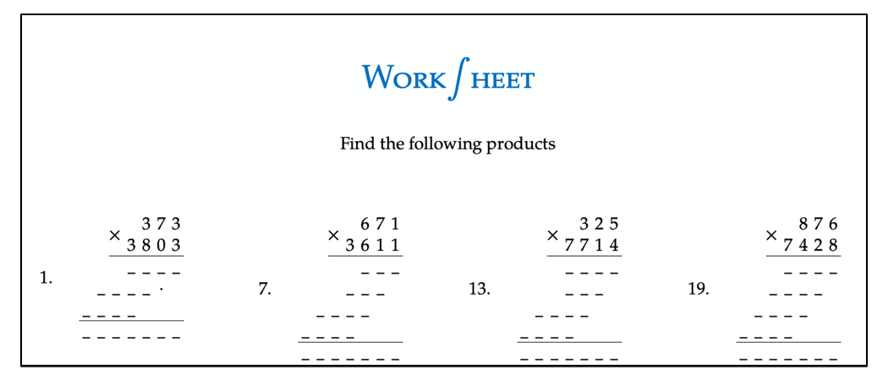

<p align="center">
    
</p>

<p align="center">
    <a href = "https://www.sagemath.org">
        
    </a>
    <a href = "https://www.cocalc.com">
        
    </a>
        
				
</p>

<p align="center">
    
</p>

Worksheets is a LaTeX project used to create randomly generated worksheets that can be easily reproduced and are single-sided.  Both the questions and answers on a given worksheet are generated using SageMath and typeset using LaTeX. It is the `sagetex.sty` package that provides latex the access to SageMath to perform calculations and reference stored values. This worksheets project has been designed to easily run on CoCalc, but it can also be made to work on a local MacOs/Linux machine with some care and attention to ensuring all the dependencies are satisfied.  If you are using >= MacOS 10.15, then getting SageMath to install locally in my experience has been a massive headache, which is why I prefer to just run anything using SageMath on CoCalc. 


## Style Files

This project comes with 3 style files that can either be placed in the folder where your foo.tex file are stored or in your local _texmf_ folder:

1. markolsonworksheet.sty [Required]
1. markolsoncolorsthlm.sty [Required]
1. markolsonmath.sty [Optional]

You must also have a working `sagetex.sty` style file either in your latex path or project directory that corresponds to the SageMath release installed on your computer.  CoCalc ensures the correct file is in the correct place, so nothing required by the user here.  Note that if you are using CoCalc, then your local _texmf_ can be found in your home directory:
_~/texmf/tex/latex/_.  Your sagetex.sty should already be included in this path if you are using CoCalc.

Each worksheet is built using the latex article document class layout. It is further styled using the `markolsonworksheet.sty` file. The colors used for the worksheet are being referenced from the `markolsoncolorsthlm.sty` file; however, you could modify the existing color definitions in the `markolsoncolorsthlm.sty` file or define your own directly in the `markolsonworksheet.sty` to fulfil your color choice preferences.

The `markolsonmath.sty` file is not required.  It is simply a collection of commands that I use to typeset my latex documents. By default, you should not need to include this package in your preamble.  

## Document Structure

### Preamble

``` tex
%-=-=-=-=-=-=-=-=-=-=-=-=-=-=-=-=-=-=-=-=-=-=-=-=
%	DOCUMENT CLASS & PACKAGES
%-=-=-=-=-=-=-=-=-=-=-=-=-=-=-=-=-=-=-=-=-=-=-=-=

\documentclass[a4paper, 11pt]{article}
\usepackage{markolsonworksheet}
\usepackage{markolsoncolorsthlm}
%\usepackage{markolsonmath}
```

The preamble starts by defining the document class as article with options of a4paper and base font size of 11 points.  Notice that both the `markolsonworksheet` and `markolsoncolorsthlm` packages are being called while the line used to call the `markolsonmath` package is commented out.  

For some worksheets, you might want to include a package to help format your content.  Suppose you are creating a worksheet with with questions that involve column addition that could be easily typeset using the xlop package. Then all you need to do is append the `\usepackage{xlop}` to your preamble.

``` tex
%-=-=-=-=-=-=-=-=-=-=-=-=-=-=-=-=-=-=-=-=-=-=-=-=
%	DOCUMENT CLASS & PACKAGES
%-=-=-=-=-=-=-=-=-=-=-=-=-=-=-=-=-=-=-=-=-=-=-=-=

\documentclass[a4paper, 11pt]{article}
\usepackage{markolsonworksheet}
\usepackage{markolsoncolorsthlm}
%\usepackage{markolsonmath}

\usepackage{xlop}
```

### The Document

#### The Header Title

<p align="center">
    
</p>

Each worksheet has the same title _Worksheet_.  The worksheet header title is globally defined in the `markolsonworksheet.sty` file and included on the worksheet using the `\maketitle` command.  

```latex
%-=-=-=-=-=-=-=-=-=-=-=-=-=-=-=-=-=-=-=-=-=-=-=-=
%	DOCUMENT CLASS & PACKAGES
%-=-=-=-=-=-=-=-=-=-=-=-=-=-=-=-=-=-=-=-=-=-=-=-=

\begin{document}

\maketitle % Print the title 
```
Of course, you could choose to design your custom title from the style file or manually create your own title by replacing the `\maketitle` command with your own custom title.


#### Worksheets Questions & Answers

While the `sagesilent` environment is written before the latex code used to typeset the worksheet questions and answers, we should first consider what it is we want to be expressed on the worksheet.  In general, we are looking to create a latex enumerated environment and populate it with items that represent the questions.  

```latex
begin{enumerate}
 \item Question 1
 \item Question 2
 \item Question 3
 .
 .
 .
 \item Question n
\end{enumerate}
```
The number of questions on a given worksheet will vary, so we are going to have Sage generate the latex code to write out each `\item` line within the enumerated environment.  Sage is now in charge of writing some latex code and we can forget about having to write each `\item` line of enumerated environment for each unique worksheet.  

To do this, Sage will assign all `\item` lines to a variable called `qoutput` of type raw string and we can then access that variable in our latex code using a `\sagestr{}` command.  I chose the variable qoutput for _question output_, but you could easily change this to something more to your liking.  Now, our enumerated environment is simplified to one line of code and can generate an `\item` line for each question within our enumerated environment:

```latex
\begin{enumerate}
	\sagestr{qoutput}
\end{enumerate}
```
In fact a similar process will be used to generate the answers using the variable `aoutput`:

```latex
\begin{enumerate}
\sagestr{aoutput}
\end{enumerate}
```
Now we have a goal to have sage generate two variables `qoutput` and `aoutput`.


#### SageSilent Environment

The SageSilent environment is where all the magic happens as it is within this environment where you will write the majority of the code necessary to generate the questions, the answers and the perhaps the latex code necessary to display them.  In general, we will be looking to define the two variables `qoutput` and `aoutput`.

Since our worksheets are going to be randomly generated and we also want to be able to reproduce these worksheets, so we are going to want to define the random seed used to generate all the random values in our worksheet by setting the variable `t` to a randomly generated integer that will then be used to set the random seed.

```python
t=ZZ.random_element(999999)
set_random_seed(t)
````

<p align="center">
    
</p>

Each worksheet will generate a random integer value of `t` and will be displayed on the worksheet footer.  This will then allow you to manually enter this value as the argument of the `set_random_seed(t)`, if needed, to reproduce the randomly generated questions and answers.  This makes your randomly generated worksheets reproducible.  

It's now time to start generating some questions with their corresponding answers.  While the generators may differ for each worksheet you create, the goal remains the same - produce a multiline string of questions and assign it to the variable `qoutput` and a multiline string of answers and assign it to the variable `aoutput`.  These two variables are initialised as empty strings.

```python
t=ZZ.random_element(999999)
set_random_seed(t)

qoutput = ""
aoutput = ""

```

Maybe our question is to find the product of two integers.  To generate each question we are going to need:

1. two factors: a multiplicand and a multiplier
1. an expression: multiplicand x multiplier

To generate each answer, we are going to have Sage evaluate the expression multiplicand x multiplier.

One approach might be to define and initialise the following variables:

- `numberOfQuestions = 100`
- `smallestFactor = 3`
_ `largestFactor = 13`
- `negativeFactors = False`

So here our worksheet should have 100 questions made up of expressions of the form _multiplicand_ x _multiplier_ where the largest factor possible is 13 and the smallest is 3.  We have even set a variable of type Boolean to choose if we want to include negative integers in our products.

```python
t=ZZ.random_element(999999)
set_random_seed(t)

qoutput = ""
aoutput = ""

numberOfQuestions = 100
smallestFactor = 3
largestFactor = 13
negativeFactors = False

```

It is now time to generate our multiplicand and multiplier factors for each question.  Note that we have introduced the possibility of toggling between positive and negative integer factors so we are going to need to consider two cases.  For each case, we are going to assign the variable multiplicand and multiplier to a list of randomly generated integers.  
 

```python
t=ZZ.random_element(999999)
set_random_seed(t)

qoutput = ""
aoutput = ""

numberOfQuestions = 100
smallestFactor = 3
largestFactor = 13
negativeFactors = False

if negativeFactors == False:
  multiplicand=[ZZ.random_element(smallestFactor,largestFactor+1) for i in range(numberOfQuestions)]
  multiplier=[ZZ.random_element(smallestFactor,largestFactor+1) for i in range(numberOfQuestions)]
else:
  multiplicand=[(-1)^(ZZ.random_element(1,3))*ZZ.random_element(smallestFactor,largestFactor+1) for i in range(numberOfQuestions)]
  multiplier=[(-1)^(ZZ.random_element(1,3))*ZZ.random_element(smallestFactor,largestFactor+1) for i in range(numberOfQuestions)]
```

Using one line of code,
`answer=[multiplicand[i]*multiplier[i] for i in range(numberOfQuestions)]`
we can generate a list of answers.

```python
t=ZZ.random_element(999999)
set_random_seed(t)

qoutput = ""
aoutput = ""

numberOfQuestions = 100
smallestFactor = 3
largestFactor = 13
negativeFactors = False

if negativeFactors == False:
  multiplicand=[ZZ.random_element(smallestFactor,largestFactor+1) for i in range(numberOfQuestions)]
  multiplier=[ZZ.random_element(smallestFactor,largestFactor+1) for i in range(numberOfQuestions)]
else:
  multiplicand=[(-1)^(ZZ.random_element(1,3))*ZZ.random_element(smallestFactor,largestFactor+1) for i in range(numberOfQuestions)]
  multiplier=[(-1)^(ZZ.random_element(1,3))*ZZ.random_element(smallestFactor,largestFactor+1) for i in range(numberOfQuestions)]

answer=[multiplicand[i]*multiplier[i] for i in range(numberOfQuestions)]

```
The last step is to have Sage generate the latex code to write out the `\item`s for both the question and answer enumerated environments.  It is actually, two Python raw strings that we are going to assign to our variables `qoutput` and `aoutput`.  

```python
for question in range(numberOfQuestions):
  qoutput += r"\item ${} \, \times \, {}$ \hfill \framebox[10ex]{{\phantom{{1}}}}".format(multiplicand[question], multiplier[question])

  aoutput += r"\item ${} \, \times \, {}$ \hfill \framebox[10ex]{{\cRed{{{}}}}}" .format(multiplicand[question], multiplier[question], answer[question])
```

and here is the full sagetex environment code.

```python
t=ZZ.random_element(999999)
set_random_seed(t)

qoutput = ""
aoutput = ""

numberOfQuestions = 100
smallestFactor = 3
largestFactor = 13
negativeFactors = False

if negativeFactors == False:
  multiplicand=[ZZ.random_element(smallestFactor,largestFactor+1) for i in range(numberOfQuestions)]
  multiplier=[ZZ.random_element(smallestFactor,largestFactor+1) for i in range(numberOfQuestions)]
else:
  multiplicand=[(-1)^(ZZ.random_element(1,3))*ZZ.random_element(smallestFactor,largestFactor+1) for i in range(numberOfQuestions)]
  multiplier=[(-1)^(ZZ.random_element(1,3))*ZZ.random_element(smallestFactor,largestFactor+1) for i in range(numberOfQuestions)]

answer=[multiplicand[i]*multiplier[i] for i in range(numberOfQuestions)]

qoutput = ""
aoutput = ""

for question in range(numberOfQuestions):
  qoutput += r"\item ${} \, \times \, {}$ \hfill \framebox[10ex]{{\phantom{{1}}}}".format(multiplicand[question], multiplier[question])

  aoutput +=r"\item ${} \, \times \, {}$ \hfill \framebox[10ex]{{\cRed{{{}}}}}" .format(multiplicand[question], multiplier[question], answer[question])
```

#### The Document

```latex
%-=-=-=-=-=-=-=-=-=-=-=-=-=-=-=-=-=-=-=-=-=-=-=-=
%	DOCUMENT CLASS & PACKAGES
%-=-=-=-=-=-=-=-=-=-=-=-=-=-=-=-=-=-=-=-=-=-=-=-=

\documentclass[a4paper, 11pt]{article}
\usepackage{markolsonworksheet}
\usepackage{markolsoncolorsthlm}
\usepackage{markolsonmath}

%-=-=-=-=-=-=-=-=-=-=-=-=-=-=-=-=-=-=-=-=-=-=-=-=
%	BEGIN DOCUMENT
%-=-=-=-=-=-=-=-=-=-=-=-=-=-=-=-=-=-=-=-=-=-=-=-=

\begin{document}

\maketitle % Print the title section

%-=-=-=-=-=-=-=-=-=-=-=-=-=-=-=-=-=-=-=-=-=-=-=-=
%	SAGE SILENT
%-=-=-=-=-=-=-=-=-=-=-=-=-=-=-=-=-=-=-=-=-=-=-=-=

\begin{sagesilent}

t=ZZ.random_element(999999)
set_random_seed(t)

numberOfQuestions = 100
smallestFactor = 3
largestFactor = 13
negativeFactors = False

if negativeFactors == False:
  multiplicand=[ZZ.random_element(smallestFactor,largestFactor+1) for i in range(numberOfQuestions)]
  multiplier=[ZZ.random_element(smallestFactor,largestFactor+1) for i in range(numberOfQuestions)]
else:
  multiplicand=[(-1)^(ZZ.random_element(1,3))*ZZ.random_element(smallestFactor,largestFactor+1) for i in range(numberOfQuestions)]
  multiplier=[(-1)^(ZZ.random_element(1,3))*ZZ.random_element(smallestFactor,largestFactor+1) for i in range(numberOfQuestions)]

answer=[multiplicand[i]*multiplier[i] for i in range(numberOfQuestions)]

qoutput = ""
aoutput = ""

for question in range(numberOfQuestions):
  qoutput += r"\item ${} \, \times \, {}$ \hfill \framebox[10ex]{{\phantom{{1}}}}".format(multiplicand[question], multiplier[question])

  aoutput +=r"\item ${} \, \times \, {}$ \hfill \framebox[10ex]{{\cRed{{{}}}}}" .format(multiplicand[question], multiplier[question], answer[question])

\end{sagesilent}

%-=-=-=-=-=-=-=-=-=-=-=-=-=-=-=-=-=-=-=-=-=-=-=-=
%	WORKSHEET INSTRUCTIONS
%-=-=-=-=-=-=-=-=-=-=-=-=-=-=-=-=-=-=-=-=-=-=-=-=
\centering{Find the following products}\\
\vspace{0.5cm}

%-=-=-=-=-=-=-=-=-=-=-=-=-=-=-=-=-=-=-=-=-=-=-=-=
%	WORKSHEET LAYOUT
%-=-=-=-=-=-=-=-=-=-=-=-=-=-=-=-=-=-=-=-=-=-=-=-=

\begin{multicols}{4}

\begin{enumerate}
\sagestr{qoutput}
\end{enumerate}

\end{multicols}

\customfoot

\newpage
\answers

\begin{multicols}{4}

\begin{enumerate}
\sagestr{aoutput}
\end{enumerate}

\end{multicols}

\customfoot
\end{document}
```